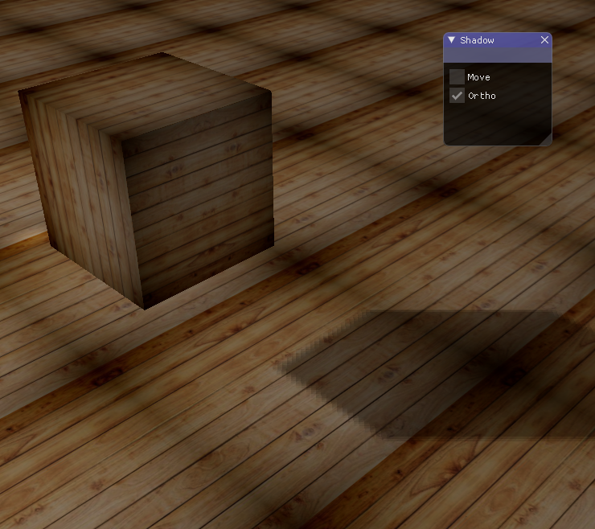
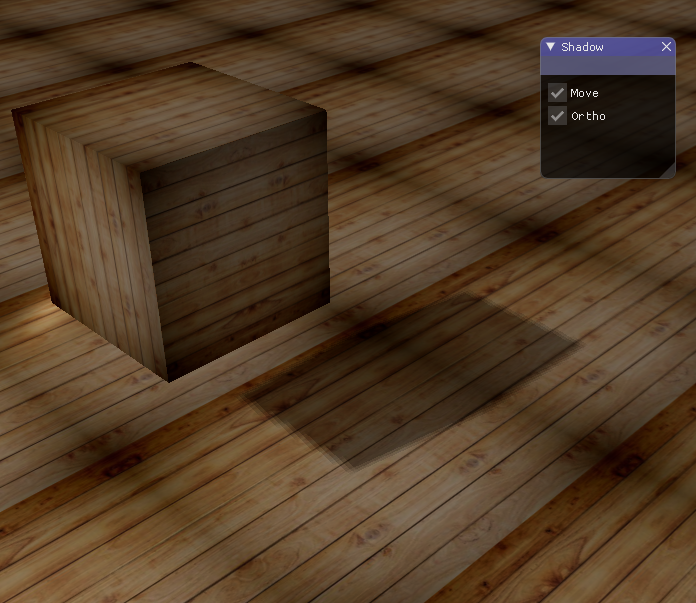
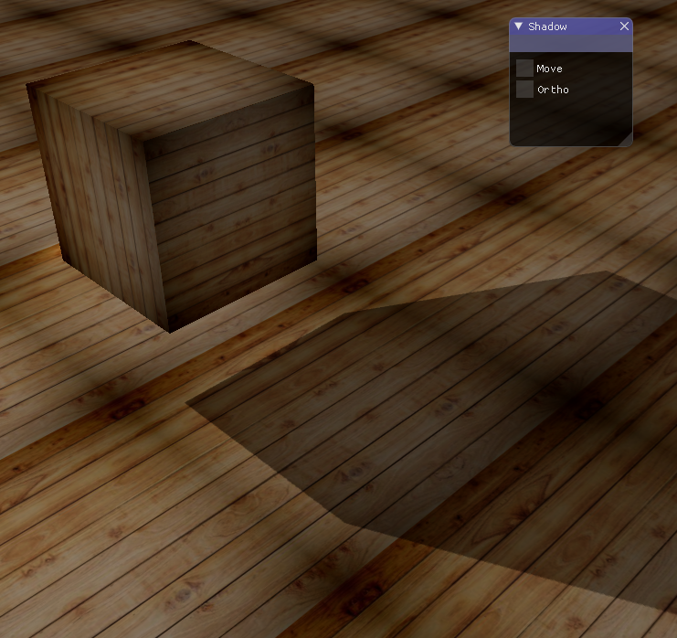

# 实验报告
## 张子轩 16340297
## 实验要求
### Basic:
1. 实现方向光源的Shadowing Mapping:
    + 要求场景中至少有一个object和一块平面(用于显示shadow)
    + 光源的投影方式任选其一即可
    + 在报告里结合代码，解释Shadowing Mapping算法
2. 修改GUI
### Bonus:
1. 实现光源在正交/透视两种投影下的Shadowing Mapping
2. 优化Shadowing Mapping (可结合References链接，或其他方法。优化方式越多越好，在报告里说明，有加分)

## 实现效果：

+ 初始状态：

+ 移动光源：

+ 使用透视投影：

## 算法描述

+ 生成深度贴图（按照光线透视图渲染的纹理）：
    
    - 创建一个帧缓冲对象(帧缓冲对象用于存储深度值）以及一个2D的纹理对象：

        	const unsigned int SHADOW_WIDTH = 1024, SHADOW_HEIGHT = 1024;
            unsigned int depthMapFBO;
            glGenFramebuffers(1, &depthMapFBO);
            // create depth texture
            unsigned int depthMap;
            glGenTextures(1, &depthMap);
            glBindTexture(GL_TEXTURE_2D, depthMap);
            glTexImage2D(GL_TEXTURE_2D, 0, GL_DEPTH_COMPONENT, SHADOW_WIDTH, SHADOW_HEIGHT, 0, GL_DEPTH_COMPONENT, GL_FLOAT, NULL);
            glTexParameteri(GL_TEXTURE_2D, GL_TEXTURE_MIN_FILTER, GL_NEAREST);
            glTexParameteri(GL_TEXTURE_2D, GL_TEXTURE_MAG_FILTER, GL_NEAREST);
            glTexParameteri(GL_TEXTURE_2D, GL_TEXTURE_WRAP_S, GL_CLAMP_TO_BORDER);
            glTexParameteri(GL_TEXTURE_2D, GL_TEXTURE_WRAP_T, GL_CLAMP_TO_BORDER);
            float borderColor[] = { 1.0, 1.0, 1.0, 1.0 };
            glTexParameterfv(GL_TEXTURE_2D, GL_TEXTURE_BORDER_COLOR, borderColor);

            glBindFramebuffer(GL_FRAMEBUFFER, depthMapFBO);
            glFramebufferTexture2D(GL_FRAMEBUFFER, GL_DEPTH_ATTACHMENT, GL_TEXTURE_2D, depthMap, 0);
            glDrawBuffer(GL_NONE);
            glReadBuffer(GL_NONE);
            glBindFramebuffer(GL_FRAMEBUFFER, 0);

    - 生成深度贴图

            glm::mat4 lightProjection, lightView;
            glm::mat4 lightSpaceMatrix;
            float near_plane = 1.0f, far_plane = 7.5f;
            if (tag == 1) {
                lightProjection = glm::perspective(glm::radians(45.0f), (GLfloat)SHADOW_WIDTH / (GLfloat)SHADOW_HEIGHT, near_plane, far_plane);
            }
            if (tag == 0) {
                lightProjection = glm::ortho(-10.0f, 10.0f, -10.0f, 10.0f, near_plane, far_plane);
            }
            lightView = glm::lookAt(lightPos, glm::vec3(0.0f), glm::vec3(0.0, 1.0, 0.0));
            lightSpaceMatrix = lightProjection * lightView;
            // render scene from light's point of view
            simpleDepthShader.use();
            simpleDepthShader.setMat4("lightSpaceMatrix", lightSpaceMatrix);

            glViewport(0, 0, SHADOW_WIDTH, SHADOW_HEIGHT);
            glBindFramebuffer(GL_FRAMEBUFFER, depthMapFBO);
            glClear(GL_DEPTH_BUFFER_BIT);
            glActiveTexture(GL_TEXTURE0);
            glBindTexture(GL_TEXTURE_2D, woodTexture);
            renderScene(simpleDepthShader);

+ 纹理读取：

    	unsigned int woodTexture = loadTexture("G:/CG/1634027_ZhangZixuan_hw7_v0/code/OpenGL 1/OpenGL 1/11.jpg");

        unsigned int loadTexture(char const* path)
        {
            unsigned int textureID;
            glGenTextures(1, &textureID);

            int width, height, nrComponents;
            unsigned char* data = stbi_load(path, &width, &height, &nrComponents, 0);
            if (data)
            {
                GLenum format;
                if (nrComponents == 1)
                    format = GL_RED;
                else if (nrComponents == 3)
                    format = GL_RGB;
                else if (nrComponents == 4)
                    format = GL_RGBA;

                glBindTexture(GL_TEXTURE_2D, textureID);
                glTexImage2D(GL_TEXTURE_2D, 0, format, width, height, 0, format, GL_UNSIGNED_BYTE, data);
                glGenerateMipmap(GL_TEXTURE_2D);

                glTexParameteri(GL_TEXTURE_2D, GL_TEXTURE_WRAP_S, format == GL_RGBA ? GL_CLAMP_TO_EDGE : GL_REPEAT); // for this tutorial: use GL_CLAMP_TO_EDGE to prevent semi-transparent borders. Due to interpolation it takes texels from next repeat 
                glTexParameteri(GL_TEXTURE_2D, GL_TEXTURE_WRAP_T, format == GL_RGBA ? GL_CLAMP_TO_EDGE : GL_REPEAT);
                glTexParameteri(GL_TEXTURE_2D, GL_TEXTURE_MIN_FILTER, GL_LINEAR_MIPMAP_LINEAR);
                glTexParameteri(GL_TEXTURE_2D, GL_TEXTURE_MAG_FILTER, GL_LINEAR);

                stbi_image_free(data);
            }
            else
            {
                std::cout << "Texture failed to load at path: " << path << std::endl;
                stbi_image_free(data);
            }

            return textureID;
        }

+ 阴影渲染：

    - 以光线的透视图进行场景渲染：

            #version 330 core
            layout (location = 0) in vec3 aPos;

            uniform mat4 lightSpaceMatrix;
            uniform mat4 model;

            void main()
            {
                gl_Position = lightSpaceMatrix * model * vec4(aPos, 1.0);
            }

    - 顶点着色器中增加对纹理的处理。

    - 像素着色器,在上次作业的基础上加上计算阴影的内容：

            float ShadowCalculation(vec4 fragPosLightSpace)
            {
                // perform perspective divide
                vec3 projCoords = fragPosLightSpace.xyz / fragPosLightSpace.w;
                // transform to [0,1] range
                projCoords = projCoords * 0.5 + 0.5;
                // get closest depth value from light's perspective (using [0,1] range fragPosLight as coords)
                float closestDepth = texture(shadowMap, projCoords.xy).r; 
                // get depth of current fragment from light's perspective
                float currentDepth = projCoords.z;
                // calculate bias (based on depth map resolution and slope)
                vec3 normal = normalize(fs_in.Normal);
                vec3 lightDir = normalize(lightPos - fs_in.FragPos);
                float bias = max(0.05 * (1.0 - dot(normal, lightDir)), 0.005);
                // check whether current frag pos is in shadow
                // float shadow = currentDepth - bias > closestDepth  ? 1.0 : 0.0;
                // PCF
                float shadow = 0.0;
                vec2 texelSize = 1.0 / textureSize(shadowMap, 0);
                for(int x = -1; x <= 1; ++x)
                {
                    for(int y = -1; y <= 1; ++y)
                    {
                        float pcfDepth = texture(shadowMap, projCoords.xy + vec2(x, y) * texelSize).r; 
                        shadow += currentDepth - bias > pcfDepth  ? 1.0 : 0.0;        
                    }    
                }
                shadow /= 9.0;
                
                // keep the shadow at 0.0 when outside the far_plane region of the light's frustum.
                if(projCoords.z > 1.0)
                    shadow = 0.0;
                    
                return shadow;
            }

## Bonus

+ 切换两种不同的投影方式
    
            if (isOrtho) {
                lightProjection = glm::ortho(-10.0f, 10.0f, -10.0f, 10.0f, near_plane, far_plane);
            }
            else{
                lightProjection = glm::perspective(glm::radians(45.0f), (GLfloat)SHADOW_WIDTH / (GLfloat)SHADOW_HEIGHT, near_plane, far_plane);
            }

+ 改进阴影质量
    - 在计算阴影时设置一个偏移量解决阴影失真问题：

            float bias = max(0.05 * (1.0 - dot(normal, lightDir)), 0.005);
            shadow += currentDepth - bias > pcfDepth  ? 1.0 : 0.0;

    - 用PCF方案（多次采样计算均值）解决阴影的锯齿：

            float shadow = 0.0;
            vec2 texelSize = 1.0 / textureSize(shadowMap, 0);
            for(int x = -1; x <= 1; ++x)
            {
                for(int y = -1; y <= 1; ++y)
                {
                    float pcfDepth = texture(shadowMap, projCoords.xy + vec2(x, y) * texelSize).r; 
                    shadow += currentDepth - bias > pcfDepth  ? 1.0 : 0.0;        
                }    
            }
            shadow /= 9.0;