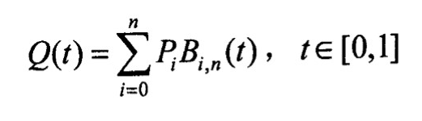

# Bezier Curve

## 实现效果见演示视频

## 具体算法

1. 鼠标控制
+ 设置鼠标点击回调事件和移动回调事件就可以获取到鼠标的点击事件和当前的位置。获取坐标后将其放入一个vector中。

        void mouse_move_callback(GLFWwindow * window, double xpos, double ypos) {

            xCur = (xpos - SCR_WIDTH / 2) / SCR_WIDTH * 2;

            yCur = 0 - (ypos - SCR_HEIGHT / 2) / SCR_HEIGHT * 2;

        };

        void mouse_button_callback(GLFWwindow * window, int button, int action, int mods)

        {

            if (button == GLFW_MOUSE_BUTTON_LEFT && action == GLFW_PRESS) {

                glm::vec2 point;

                point.x = xCur;
                point.y = yCur;

                pointSet.push_back(point);

            }

2. 绘制点和线按以前学的方法即可。

3. 绘制Bezier曲线
+ Bezier曲线公式表示为:

    
+ 其中 $B_{i,n}(t)$为伯恩斯坦（Bernstein）基函数,可以表示为:

    

+ 按照公式先计算组合数:

    	for (int i = 0; i < size; i++) {

            int k = i, x = 1;

            float c = 1.0;

            if (k > n - k)

                k = n - k;

            for (int j = n; j > n - k; j--, x++)

                c *= (float)j / x;

            B[i] = c;

        }

+ 再计算$B_{i,n}(t)$和点的坐标并将点画出来即可:

        	for (float t = 0.0; t < 1.0; t += delta) {

                float x = 0.0, y = 0.0, tmp;

                for (int i = 0; i <= n; i++) {

                    tmp = B[i] * pow(t, i) * pow(1 - t, n - i);

                    x += tmp * pointSet[i].x;

                    y += tmp * pointSet[i].y;

                }

                drawPoint(x, y, 2.0f, color);

            }

4. 曲线形成过程的绘制(bonus):

+ 具体的做法是递归地将每一条线找出每一个时刻的中间点，并将连线画出来：

        void BezierCurve::drawTangent(std::vector<glm::vec2> points, float t, ImVec4 color)
        {
            std::vector<glm::vec2> new_points;

            float x1, y1, x2, y2;

            glm::vec2 point;

            if (points.size() < 2)

                return;

            x2 = points[0].x + t * (points[1].x - points[0].x);

            y2 = points[0].y + t * (points[1].y - points[0].y);

            point.x = x2;
            point.y = y2;

            new_points.push_back(point);

            drawPoint(x2, y2, 2.0f, color);

            for (int i = 2; i <= points.size() - 1; i++) {

                x1 = x2;

                y1 = y2;

                x2 = points[i - 1].x + t * (points[i].x - points[i - 1].x);

                y2 = points[i - 1].y + t * (points[i].y - points[i - 1].y);

                point.x = x2;
                point.y = y2;

                new_points.push_back(point);

                drawPoint(x2, y2, 2.0f, color);

                drawLine(x1, y1, x2, y2, color);

            }

            drawTangent(new_points, t, color);

        }